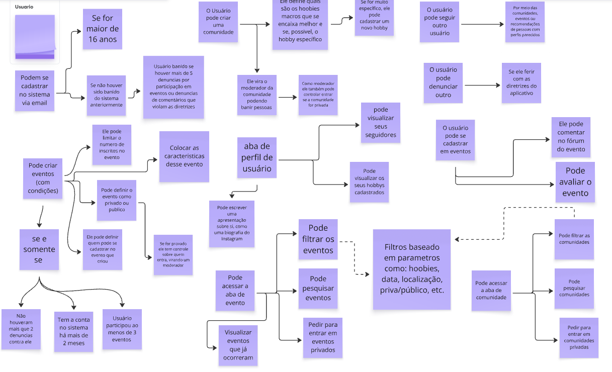
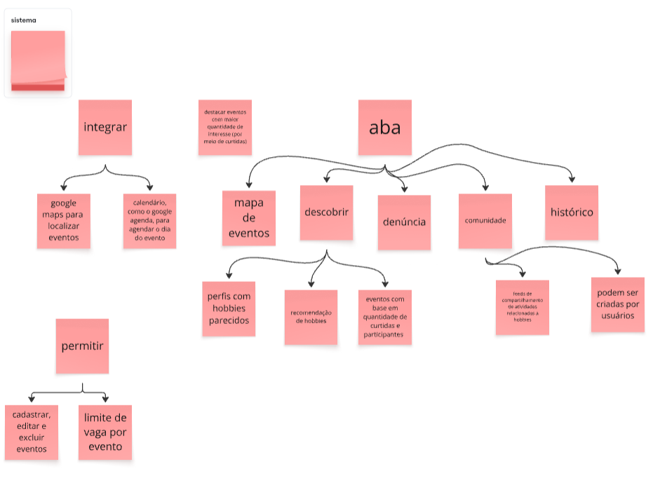

# Introdução

O brainstorming é um método colaborativo fundamental que impulsiona a inovação ao fomentar a livre geração de ideias. Em um ambiente livre de julgamentos, essa técnica permite que os participantes explorem uma ampla gama de perspectivas, o que é essencial para identificar soluções criativas e resolver problemas complexos. Diversos estudos demonstram que uma condução eficaz do brainstorming pode revelar insights valiosos sobre as necessidades dos usuários, orientando de maneira significativa o design e o aprimoramento de produtos. No contexto do aplicativo "Revele seu Hobby", essa abordagem foi especialmente valiosa para identificar funcionalidades que incentivem as pessoas a praticarem seus hobbies atuais e descobrirem novos interesses, além de criar mecanismos eficientes para conectar pessoas com interesses semelhantes.

# Objetivo

Os propósitos centrais desta atividade são:

- **Centralizar e Organizar as Ideias:** Compilar e documentar todas as propostas geradas nas sessões de brainstorming para o aplicativo "Revele seu Hobby", criando um repositório único para consulta e análise.  
- **Embasar a Tomada de Decisão:** Utilizar os insights coletados para direcionar as próximas fases do projeto, especialmente na definição e priorização de requisitos e funcionalidades que incentivem a prática de hobbies e a conexão entre usuários com interesses semelhantes.  
- **Garantir a Rastreabilidade:** Facilitar a referência futura às ideias, permitindo que as contribuições sejam corretamente atribuídas aos seus participantes e ao contexto em que foram criadas.

# Metodologia  

A sessão de Brainstorming foi conduzida visando maximizar a criatividade e a eficácia das contribuições, seguindo diretrizes bem definidas, tais como:

- Todas as ideias foram registradas sem julgamento prévio, incentivando a produção de um grande volume de sugestões relacionadas ao incentivo de práticas de hobbies e conexão entre usuários.  
- Os participantes foram encorajados a aprimorar e combinar as propostas uns dos outros, promovendo a construção colaborativa de soluções para o aplicativo "Revele seu Hobby".  
- O foco foi mantido no objetivo central da sessão, garantindo que todas as ideias estivessem alinhadas com o propósito do projeto: incentivar as pessoas a praticarem seus hobbies atuais, descobrirem novos interesses e conectar usuários com hobbies semelhantes.

Todas as contribuições foram documentadas de acordo com metodologias consagradas (Wigers & Beatty, 2012).

## Integrantes Envolvidos

- [Ana Luiza Soares](https://github.com/Ana-Luiza-SC)   
- [Gabriel Flores](https://github.com/Gabrielfcoelho)
- [Ígor Veras Daniel](https://github.com/igorvdaniel)
- [Leonardo Barcellos](https://github.com/oyLeonardo)
- [Matheus de Alcântara](https://github.com/matheusdealcantara)
- [Natan Almeida](https://github.com/natanalmeida03)
- [Ruan Sobreira Carvalho](https://github.com/Ruan-Carvalho)
- [Yzabella Pimenta](https://github.com/redjsun)

## Tema: Desenvolvimento do Aplicativo "Revele seu Hobby" para Prática e Conexão através de Hobbies

### Descrição:  

  Nesta sessão, o foco foi definir e elicitar requisitos para o desenvolvimento do aplicativo "Revele seu Hobby", levando em conta as necessidades dos usuários que desejam praticar seus hobbies atuais, descobrir novos interesses e conectar-se com pessoas que compartilham dos mesmos hobbies, considerando aspectos de usabilidade e segurança.  

### Diretrizes e Referências:  

  A sessão seguiu os princípios de brainstorming descritos por Barbosa et al. (2021). 

### Etapas da Sessão:  

  1. **Abertura e Contextualização:**  
     Apresentação dos participantes, definição dos objetivos da sessão e explicação das regras. A reunião do brainstorming foi feita presencialmente devido a conflitos de horários de alguns participantes.  
  2. **Pergunta Norteadora:**  
     *"Se você fosse utilizar um aplicativo sobre Hobbies, o que você gostaria de ter nele, o que não gostaria e o que seria essencial?"*  
  3. **Geração e Discussão de Ideias:**  
     Coleta espontânea das ideias, discussões de ideias, seguida de agrupamento e refinamento dos conceitos.  
  4. **Encerramento:**  
     Resumo dos pontos principais e definição dos próximos passos.  
  5. **Elicitação dos Requisitos:**  
     Todas as ideias foram compiladas em uma tabela com os requisitos funcionais e não funcionais, refinados pela [Ana Luiza Soares](https://github.com/Ana-Luiza-SC)   
 e pela [Yzabella Pimenta](https://github.com/redjsun) e revisados pelo [Gabriel Flores](https://github.com/Gabrielfcoelho) afim de evitar erros e prevenir retrabalho.  
  6. **Priorização:**  
     A priorização dos requisitos será realizada em artefatos específicos de priorização em etapas posteriores.

# Requisitos Elicitados

Os requisitos elicitados foram divididos em funcionais e não funcionais.

## Requisitos funcionais

Na tabela 1 é possivel visualizar os requisitos funcionais que foram elicitados após a sessão de brainstorming.

 Tabela 1: Requisitos funcionais

 

| **identificador** | **Descrição** |
| :---- | :---- |
| BSRF01 | O sistema deve permitir a visualização de um local específico em um mapa interativo, utilizando a API do Google Maps. |
| BSRF02 | O sistema deve oferecer uma funcionalidade para agendar um evento diretamente no Google Agenda.  |
| BSRF03 | O sistema deve permitir aos usuários cadastrar eventos, definindo detalhes como data, local, categoria e regras específicas. |
| BSRF04 | O sistema de busca deve permitir aos usuários encontrar eventos de forma eficiente, com opções de pesquisa por nome, local, data, categoria e tags. |
| BSRF05 | O sistema deve permitir la criação e autenticação de usuários usando o e-mail como método principal. |
| BSRF06 | O sistema deve impedir o cadastro de um usuário que já foi banido anteriormente.  |
| BSRF07 | O sistema deve permitir que o usuário escreva uma apresentação em seu perfil. |
| BSRF08 |  O sistema deve permitir que o usuário defina seus hobbies. |
| BSRF09 | O sistema deve permitir que um usuário siga e deixe de seguir outros usuários. |
| BSRF10 | O sistema deve exibir no perfil do usuário la sua lista de seguidores e de pessoas que ele segue. |
| BSRF11 | O sistema deve permitir que um usuário denuncie outro por violação das diretrizes. |
| BSRF12 | O sistema deve banir um usuário caso ele receba mais de 5 denúncias por violação das diretrizes. |
| BSRF13 | O sistema deve permitir aos usuários editar parâmetros dos eventos. |
| BSFR14 |  A criação de eventos deve ser permitida apenas para usuários com mais de 2 meses de conta, menos de 2 denúncias e que já participaram de ao menos 3 eventos. |
| BSRF15 | O sistema deve permitir que o criador de um evento o define como "público" ou "privado". |
| BSRF16 | O sistema deve permitir que o criador de um evento limite o número de participantes.  |
| BSRF17 | O sistema deve permitir que usuários solicitem entrada em eventos privados. |
| BSRF18 | O sistema deve prover um fórum para que os participantes de um evento possam comentar. |
| BSRF19 | O sistema deve permitir que os participantes avaliem um evento após sua ocorrência. |
| BSRF20 | O sistema deve exibir no perfil do usuário um histórico dos eventos dos quais ele participou. |
| BSRF21 | O sistema deve possuir uma funcionalidade para pesquisar eventos. |
| BSRF22 | O sistema deve permitir la filtragem de eventos por hobbies, data, localização e privacidade. |
| BSRF23 | O sistema deve exibir os eventos em uma interface de mapa, destacando os que possuem maior interesse. |
| BSRF24 | O sistema deve recomendar eventos, usuários e comunidades com base em perfis e hobbies parecidos. |
| BSRF25 | O sistema deve permitir que um usuário crie uma comunidade. |
| BSRF26 |  O criador de uma comunidade deve atuar como moderador, podendo banir membros e gerenciar o acesso. |
| BSRF27 |  O sistema deve possuir uma funcionalidade para pesquisar e filtrar comunidades.  |
| BSRF28 | O sistema deve permitir que o usuário exclua os eventos que foi criado por ele e ainda não ocorreram. |
| BSRF29 | O sistema deve permitir cadastro de hobby. |
| BSRF30 | O sistema deve recomendar novos hobbies aos usuários, utilizando um modo de recomendação para analisar os hobbies já selecionados. |

 Fonte: <a href = "https://github.com/Ana-Luiza-SC">Ana Luiza Soares</a> e <a href = "https://github.com/redjsun">Yzabella Miranda</a>

## Requisitos não funcionais

Na tabela 2 é possivel visualizar os requisitos não funcionais que foram elicitados após a sessão de brainstorming.

 Tabela 2: Requisitos não  funcionais

 

| identificador | detalhe |
| :---- | :---- |
| BSRNF01 | O sistema deve ter uma interface intuitiva e responsiva, garantindo uma boa experiência de usuário em dispositivos móveis, tablets e desktops. |
| BSRNF02 | Tempo de resposta de no máximo 2 segundos para as principais operações, mesmo com alto volume de dados. |
| BSRNF03 | Conformidade com a LGPD e uso de criptografia para dados pessoais. |
| BSRNF04 | Segurança robusta com mecanismos de autenticação e autorização para proteger dados. |
| BSRNF05 | Conformidade com as diretrizes WCAG para garantir o uso por pessoas com deficiências. |

 Fonte: <a href = "https://github.com/Ana-Luiza-SC">Ana Luiza Soares</a> e <a href = "https://github.com/redjsun">Yzabella Miranda</a>

## Quadros do Brainstorming

Na figura 1 e figura 2 é possível visualizar o quadro que [Ana Luiza Soares](https://github.com/Ana-Luiza-SC) e [Yzabella Pimenta](https://github.com/redjsun) fizeram a partir da sessão de brainstorming, o quadro completo é possível visualizar [Quadro 1]()

 Figura 1: Quadro organizado Brainstorming parte 1

 Fonte: <a href = "https://github.com/Ana-Luiza-SC">Ana Luiza Soares</a> e <a href = "https://github.com/redjsun">Yzabella Miranda</a>

 
 

 Figura 2: Quadro organizado Brainstorming parte 2

 Fonte: <a href = "https://github.com/Ana-Luiza-SC">Ana Luiza Soares</a> e <a href = "https://github.com/redjsun">Yzabella Miranda</a>

 
 

 Quadro 1: Quadro completo do Brainstorming

<iframe width="768" height="432" src="https://miro.com/app/live-embed/uXjVJNkIu5g=/?embedMode=view_only_without_ui&moveToViewport=-403,445,2457,1112&embedId=482131938169" frameborder="0" scrolling="no" allow="fullscreen; clipboard-read; clipboard-write" allowfullscreen></iframe>

 

Fonte:  <a href="https://github.com/Ana-Luiza-SC">Ana Luiza Soares</a>, <a href="https://github.com/Gabrielfcoelho">Gabriel Flores</a>, <a href="https://github.com/igorvdaniel">Ígor Veras Daniel</a>, <a href="https://github.com/oyLeonardo">Leonardo Barcellos</a>, <a href="https://github.com/natanalmeida03">Natan Almeida</a>, <a href="https://github.com/Ruan-Carvalho">Ruan Sobreira Carvalho</a> e <a href="https://github.com/redjsun">Yzabella Pimenta</a>

# Referência bibliográfica

> BARBOSA, S. D. J.; SILVA, B. S. da; SILVEIRA, M. S.; GASPARINI, I.; DARIN, T.; BARBOSA, G. D. J. *Interação Humano-Computador e Experiência do Usuário*. Autopublicação, 2021\. 

> WIGERS, K.; BEATTY, J. *Software Requirements*. 3\. ed. Microsoft Press, 2012\. ISBN: 978-0-7356-2701-2.

# Histórico de Versões

| Versão | Data       | Descrição                    | Autor(es)        | Revisor(es)         | Data da revisão |
|--------|------------|------------------------------|------------------|---------------------|---------------------|  
| `1.0` |  02/09    | Criação do documento e criação de requisitos funcionais e nao funcionais | [Ana Luiza Soares](https://github.com/Ana-Luiza-SC)  e [Yzabella Pimenta](https://github.com/redjsun) | [Gabriel Flores](https://github.com/Gabrielfcoelho)  |  02/09/2025 |
| `1.1` |  03/09    | ajuste dos requisitos duplicado (08 e 09); criação da introdução, objetivo, metodologia e tema. |[Ana Luiza Soares](https://github.com/Ana-Luiza-SC) e [Yzabella Pimenta](https://github.com/redjsun) | [Gabriel Flores](https://github.com/Gabrielfcoelho)  |  03/09/2025 |
| `1.2` |  04/09    | Corrigindo erros de portugês ao longo do documento. |[Ana Luiza Soares](https://github.com/Ana-Luiza-SC) e [Yzabella Pimenta](https://github.com/redjsun) | [Leonardo Barcellos](https://github.com/oyLeonardo)  |   04/05/2025 |
| `1.3` |  04/09    | Padronizando o histórico de versionametno |[Ana Luiza Soares](https://github.com/Ana-Luiza-SC)  | [Leonardo Barcellos](https://github.com/oyLeonardo)  | 04/05/2025 |
