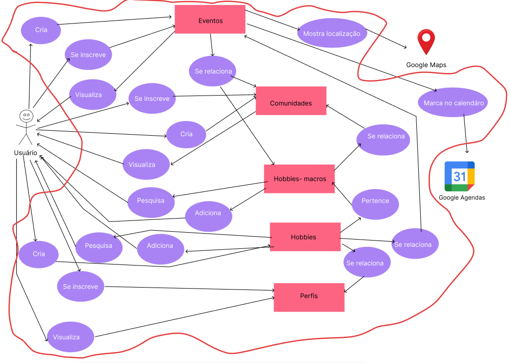
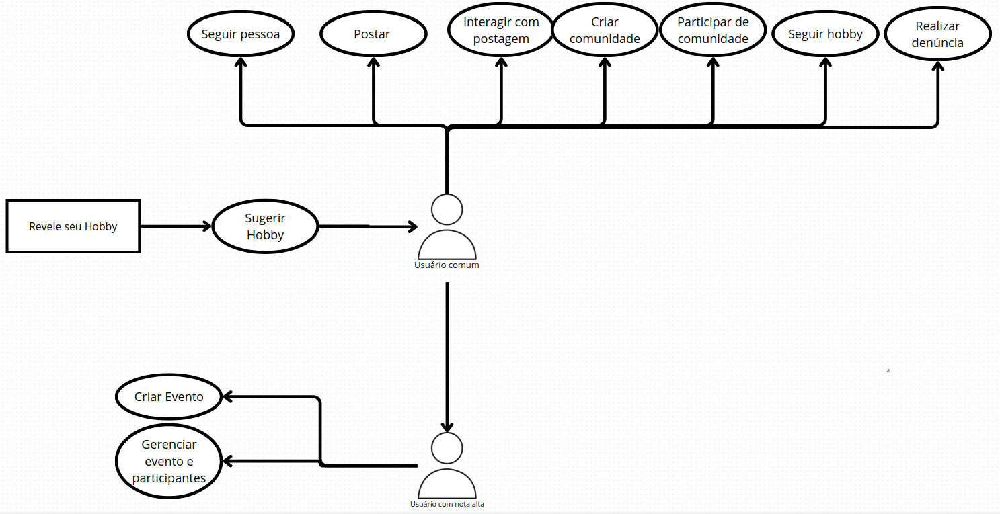
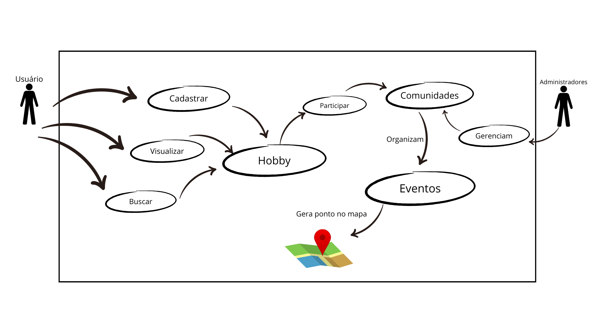
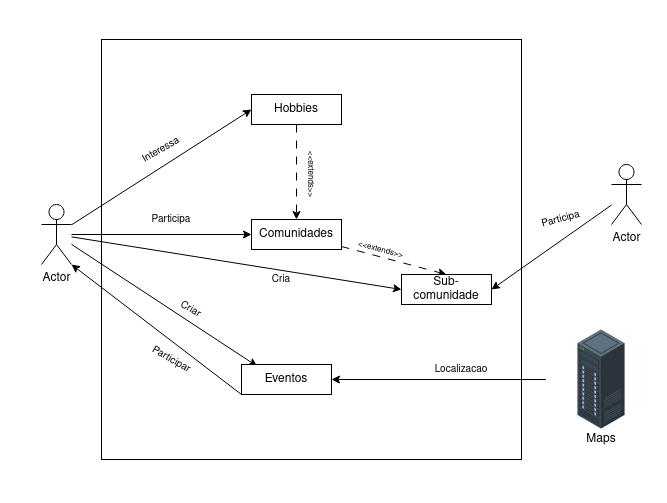
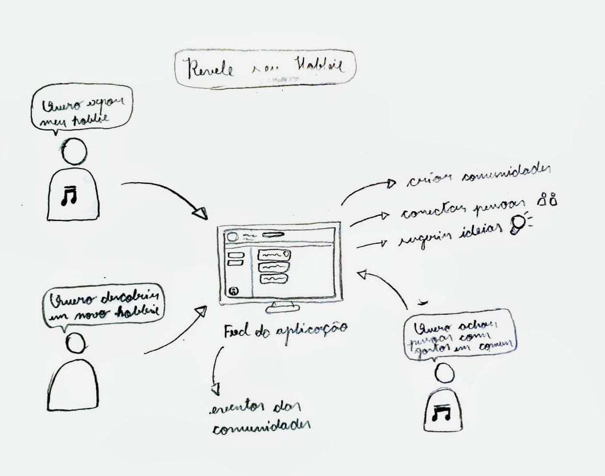
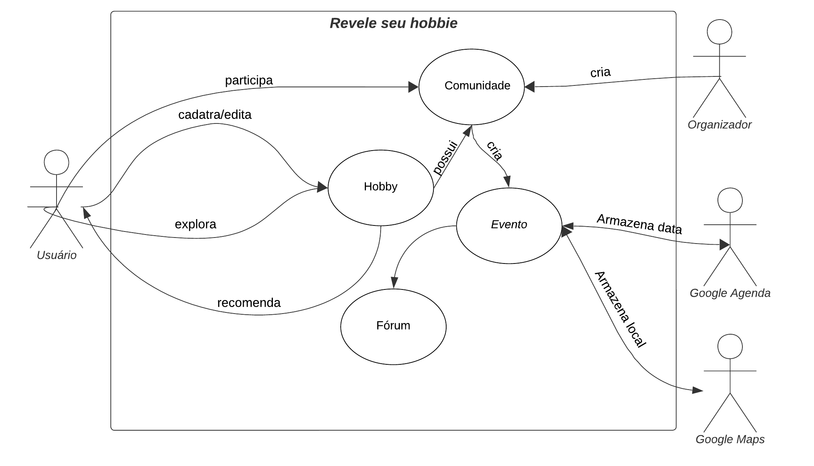
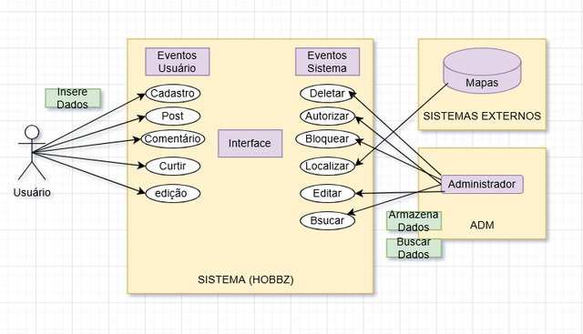
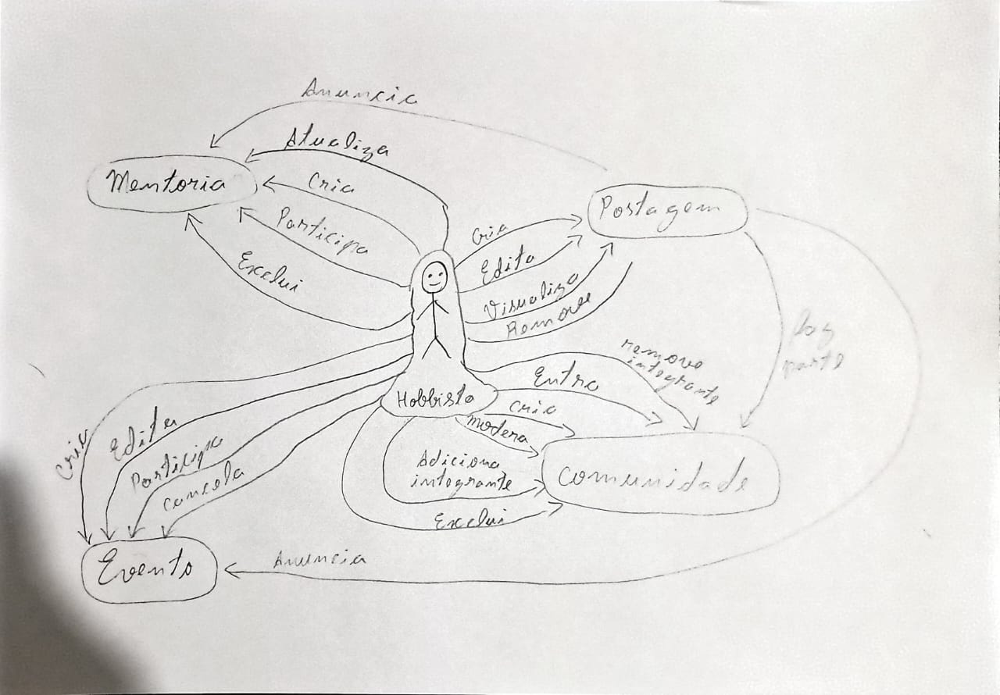

# Rich Picture

O _Rich Picture_ é uma técnica visual utilizada para representar de forma gráfica e simplificada um sistema, processo ou situação complexa. Ele é frequentemente utilizado em contextos de análise de sistemas, design thinking e resolução de problemas para ajudar a compreender e comunicar informações de maneira clara e acessível. No contexto da Engenharia de Software, se apresenta como uma ferramenta útil para representar os principais elementos e interações de um sistema, como usuários, processos, dados e fluxos de trabalho.

### Metodologia

Nesta etapa do Design Sprint, cada integrante da equipe criou um _Rich Picture_ individualmente, utilizando a ferramenta de preferência. O objetivo era representar visualmente a compreensão de cada membro sobre o problema a ser resolvido, destacando os principais elementos, atores e interações envolvidos.

### Resultados

As figuras 1 a 10 a seguir apresentam os _Rich Pictures_ criados por cada integrante da equipe:

Figura 1: Rich Picture - Ana Luiza Soares

Autor: <a href="https://github.com/Ana-Luiza-SC">Ana Luiza Soares

Figura 2: Rich Picture - Matheus de Alcântara

Autor: <a href="https://github.com/matheusdealcantara">Matheus de Alcântara

Figura 3: Rich Picture - Gabriel Flores

Autor: <a href="https://github.com/Gabrielfcoelho">Gabriel Flores

Figura 4: Rich Picture - Ígor Veras

Autor: <a href="https://github.com/igorvdaniel">Ígor Veras

Figura 5: Rich Picture - Leonardo Barcellos

Autor: <a href="https://github.com/oyLeonardo">Leonardo Barcellos

Figura 6: Rich Picture - Natan Almeida

Autor: <a href="https://github.com/natanalmeida03">Natan Almeida

Figura 7: Rich Picture - Ruan Sobreira

Autor: <a href="https://github.com/Ruan-Carvalho">Ruan Sobreira

Figura 8: Rich Picture - Yzabella Pimenta

Autor: <a href="https://github.com/redjsun">Yzabella Pimenta

Figura 9: Rich Picture - Paulo Henrique

Autor: <a href="https://github.com/Nanashii76">Paulo Henrique L. Dantas

Figura 10: Rich Picture - Arthur Augusto

Autor: <a href="https://github.com/arthur-augusto">Arthur Augusto

### Conclusão

A etapa de Sketch do Design Sprint, especificamente a criação dos _Rich Pictures_, foi fundamental para que cada integrante da equipe pudesse expressar sua visão individual sobre o problema a ser resolvido. Essa diversidade de perspectivas enriqueceu a compreensão coletiva do desafio, permitindo identificar diferentes aspectos e nuances que poderiam não ter sido considerados de outra forma.

### Bibliografia

> CTEC2402 Software Development Project. Introducing Rich Pictures. 2023.
>
> SERRANO, Milene. Requisitos - Aula 4. Aprender 3. Distrito Federal, 2016. Disponível em: https://aprender3.unb.br/pluginfile.php/3178378/mod_page/content/5/Arquitetura%20e%20Desenho%20de%20software%20-%20Aula%20Projeto-DSW%20-%20Profa.%20Milene.pdf. Acesso em: 04 set. 2025.
> MONK, A. F.; HOWARD, S. The Rich Picture: a Tool for Reasoning About Work Context. interactions, v. 5, n. 2, p. 21–30, 1998. DOI: 10.1145/274430.274434. Disponível em: https://dl.acm.org/doi/pdf/10.1145/274430.274434. Acesso em: 4 set. 2025.

### Histórico de Versões

| Versão | Data       | Descrição                       | Autor(es)               | Revisor(es)          | Data de Revisão |
|--------|------------|---------------------------------|------------------------|----------------------|-----------------|
| `1.0`  | 04/09/2025 | Criação do documento e de um Rich Picture           | [Matheus de Alcântara](https://github.com/matheusdealcantara)   | [Ana Luiza Soares](https://github.com/Ana-Luiza-SC)     |    04/09/2025   |
