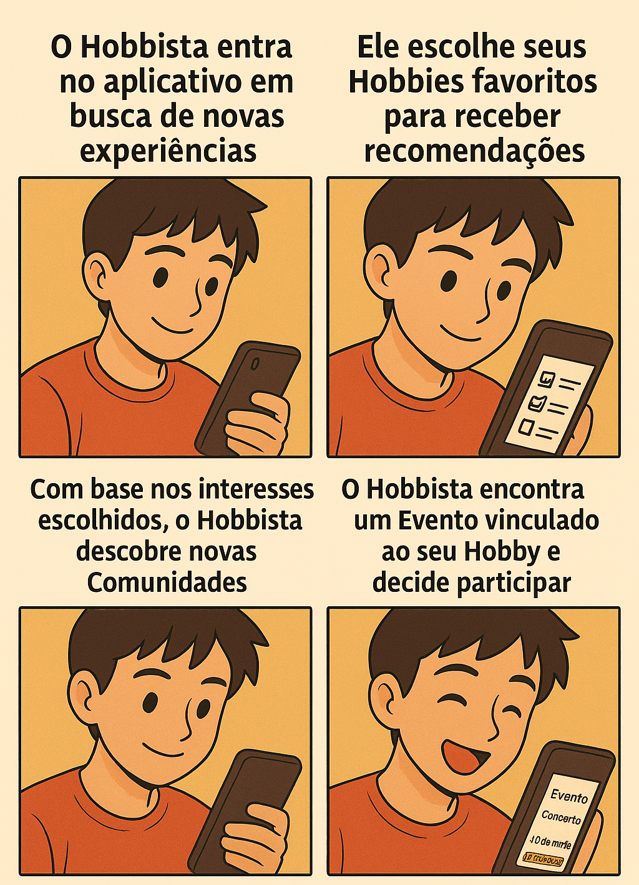

# Storyboard - Revele Seu Hobbie

## Introdução
O storyboard é uma técnica visual que permite representar, de forma simplificada, as principais interações do usuário com a plataforma Revele Seu Hobbie. A seguir, apresentamos o storyboard elaborado para o projeto, ilustrando o fluxo de navegação e as ações do usuário, validado por todos os integrantes da equipe.

## Storyboard Visual

Storyboard - Revele Seu Hobbie

Autor: <a href="https://github.com/matheusdealcantara">Matheus de Alcântara</a>

## Descrição do Fluxo
1. **Exploração de Novas Experiências**
   - O Hobbista entra no aplicativo em busca de novas experiências relacionadas aos seus interesses.
2. **Escolha de Hobbies Favoritos**
   - O usuário seleciona seus hobbies favoritos para receber recomendações personalizadas.
3. **Descoberta de Comunidades**
   - Com base nos interesses escolhidos, o Hobbista descobre novas comunidades dentro da plataforma, ampliando sua rede de contatos e oportunidades de interação.
4. **Participação em Eventos**
   - O Hobbista encontra um evento vinculado ao seu hobby e decide participar, promovendo o engajamento e a troca de experiências entre os membros da comunidade.

## Conclusão
O storyboard apresentado sintetiza o fluxo principal do usuário na plataforma Revele Seu Hobbie, desde a busca por novas experiências até a participação em eventos. Esse artefato contribui para o entendimento dos requisitos e para o alinhamento da equipe no desenvolvimento de funcionalidades essenciais para o projeto.

## Histórico de Versões
| Versão | Data       | Descrição                       | Autor(es)               | Revisor(es)          | Data de Revisão |
|--------|------------|---------------------------------|------------------------|----------------------|-----------------|
| `1.0`  | 05/09/2025 | Criação do documento do storyboard visual | [Matheus de Alcântara](https://github.com/matheusdealcantara)   | [Leonardo Barcellos](https://github.com/oyLeonardo)     |    05/09/2025   |
