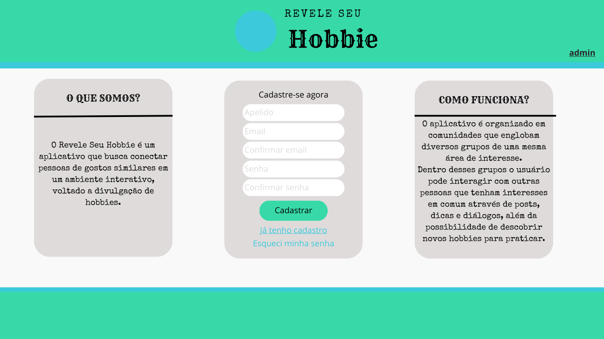
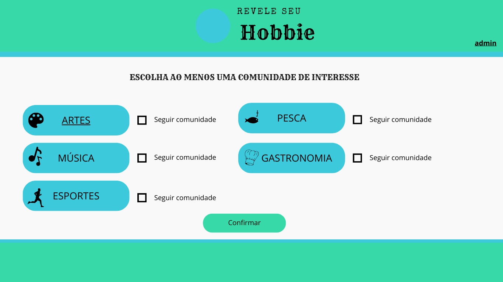
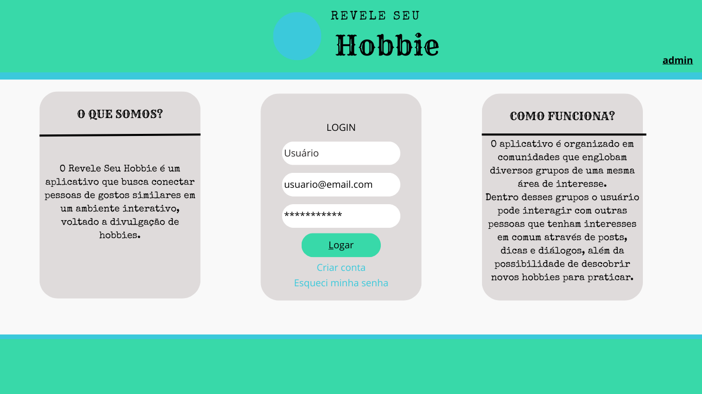
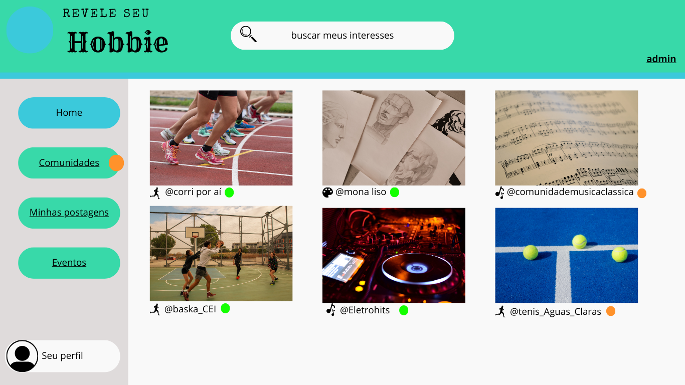
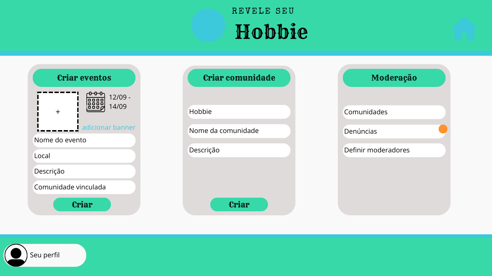
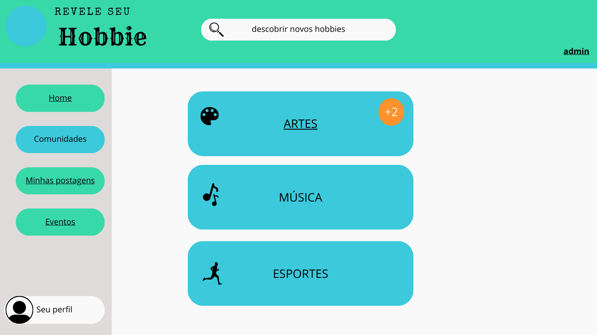
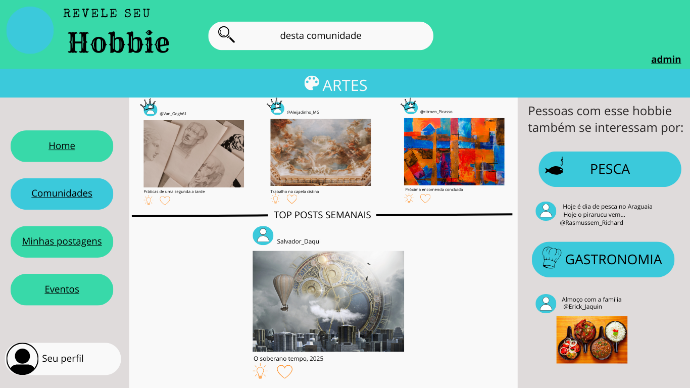
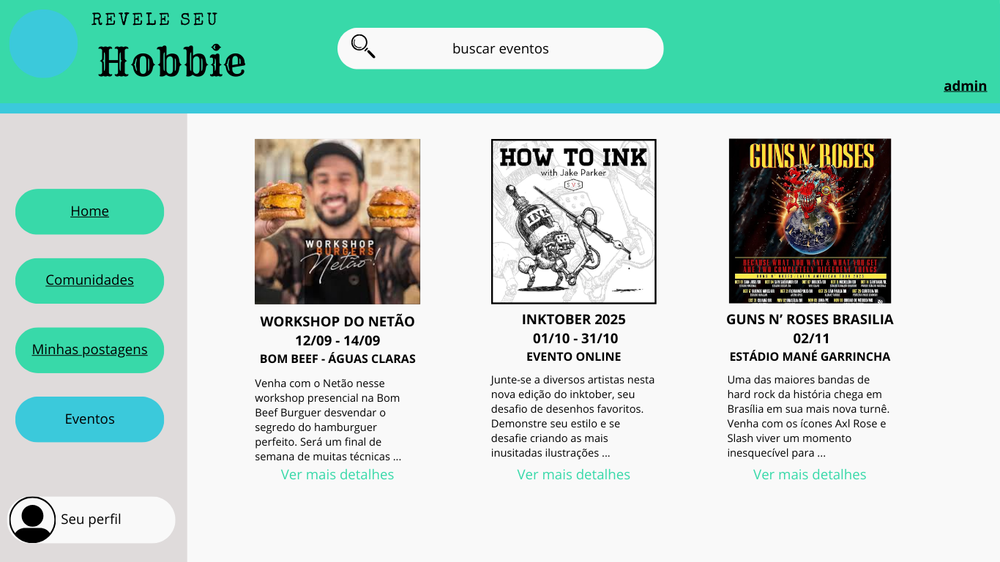

**Introdução**

A prototipagem é a criação de uma versão preliminar de um produto, neste caso, um software. É um processo fundamental no ciclo de desenvolvimento, permitindo que a equipe visualize, teste e refine ideias antes de investir tempo e recursos na construção da versão final. Em vez de desenvolver um produto completo de uma vez, a equipe constrói um protótipo, que pode ser de baixa fidelidade (um esboço em papel, por exemplo) ou de alta fidelidade (uma simulação interativa que se assemelha ao produto final).

**Metodologia**

A criação do protótipo foi executada na plataforma Canva, uma escolha estratégica pela sua interface acessível e vasta biblioteca de modelos e elementos visuais. O grupo utilizou os recursos de colaboração em tempo real da ferramenta para mapear e definir os principais fluxos do sistema. Juntos, estruturamos a navegação, as funcionalidades-chave e a organização do conteúdo, garantindo um processo de design ágil e alinhado.

As etapas seguidas foram:

    Análise dos requisitos elicitados previamente tanto no brainstorming quanto nas reuniões.
    Esboço inicial no Canva
    Melhorias contínuas do protótipo

**Artefato Produzido**

**Sign Up Page**
 
Autores: Ruan Sobreira Carvalho e Leonardo Barcellos

**Sign Up Page 2**
 
Autores: Ruan Sobreira Carvalho e Leonardo Barcellos

**Login Page**
 
Autores: Ruan Sobreira Carvalho e Leonardo Barcellos

**Home Page**
 
Autores: Ruan Sobreira Carvalho e Leonardo Barcellos

**Admin Page**
 
Autores: Ruan Sobreira Carvalho e Leonardo Barcellos

**Comunidades Page**
 
Autores: Ruan Sobreira Carvalho e Leonardo Barcellos

**Comunidades Page 2**
 
Autores: Ruan Sobreira Carvalho e Leonardo Barcellos

** Meus Posts Page **
 
Autores: Ruan Sobreira Carvalho e Leonardo Barcellos

** Eventos Page **
 
Autores: Ruan Sobreira Carvalho e Leonardo Barcellos

**Tabela 1** - Histórico de versões.

| Versão | Descrição | Autor(es) | Data | Revisor(es) | Data de Revisão |
| :---: | :---: | :---: | :---: | :---: | :---: |
| 1.0 | Criação do documento | [Leonardo Barcellos](https://github.com/oyLeonardo) | 04/09/2025 | | |