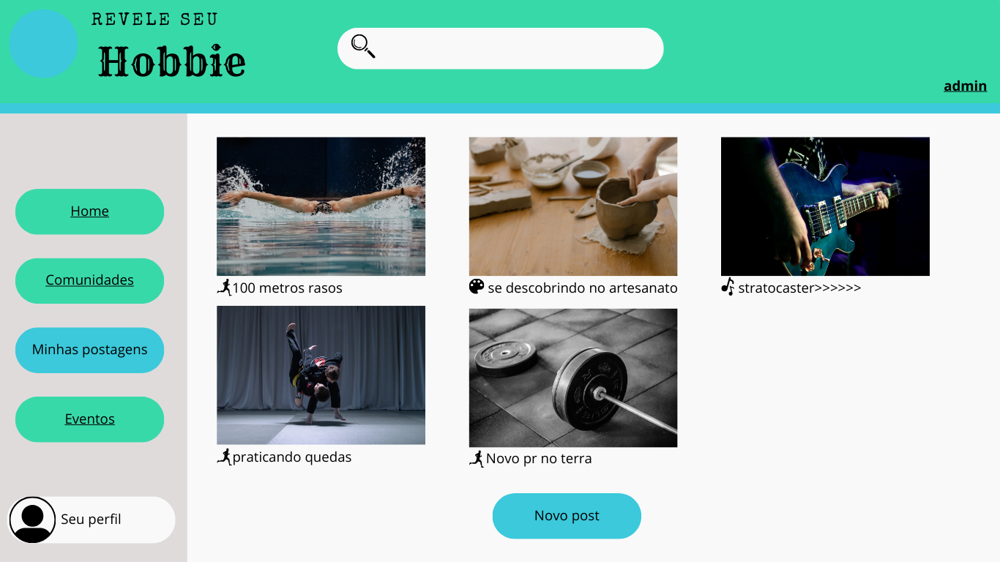

# Introdução

A prototipagem é a criação de uma versão preliminar de um produto, neste caso, um software. É um processo fundamental no ciclo de desenvolvimento, permitindo que a equipe visualize, teste e refine ideias antes de investir tempo e recursos na construção da versão final. Em vez de desenvolver um produto completo de uma vez, a equipe constrói um protótipo, que pode ser de baixa fidelidade (um esboço em papel, por exemplo) ou de alta fidelidade (uma simulação interativa que se assemelha ao produto final).

## Metodologia

A criação do protótipo foi executada na plataforma Canva, uma escolha estratégica pela sua interface acessível e vasta biblioteca de modelos e elementos visuais. O grupo utilizou os recursos de colaboração em tempo real da ferramenta para mapear e definir os principais fluxos do sistema. Juntos, estruturamos a navegação, as funcionalidades-chave e a organização do conteúdo, garantindo um processo de design ágil e alinhado.

As etapas seguidas foram:

- Análise dos requisitos elicitados previamente tanto no brainstorming quanto nas reuniões.
- Esboço inicial no Canva
- Melhorias contínuas do protótipo

## Artefato Produzido

**Sign Up Page**

 
Autores: [Ruan Carvalho](https://github.com/Ruan-Carvalho) e [Leonardo Barcellos](https://github.com/oyLeonardo)

**Sign Up Page 2**

 
Autores: [Ruan Carvalho](https://github.com/Ruan-Carvalho) e [Leonardo Barcellos](https://github.com/oyLeonardo)

**Login Page**

 
Autores: [Ruan Carvalho](https://github.com/Ruan-Carvalho) e [Leonardo Barcellos](https://github.com/oyLeonardo)

**Home Page**

 
Autores: [Ruan Carvalho](https://github.com/Ruan-Carvalho) e [Leonardo Barcellos](https://github.com/oyLeonardo)

**Admin Page**

 
Autores: [Ruan Carvalho](https://github.com/Ruan-Carvalho) e [Leonardo Barcellos](https://github.com/oyLeonardo)

**Comunidades Page**

 
Autores: [Ruan Carvalho](https://github.com/Ruan-Carvalho) e [Leonardo Barcellos](https://github.com/oyLeonardo)

**Comunidades Page 2**

 
Autores: [Ruan Carvalho](https://github.com/Ruan-Carvalho) e [Leonardo Barcellos](https://github.com/oyLeonardo)

**Meus Posts Page**

 
Autores: [Ruan Carvalho](https://github.com/Ruan-Carvalho) e [Leonardo Barcellos](https://github.com/oyLeonardo)

**Eventos Page**

 
Autores: [Ruan Carvalho](https://github.com/Ruan-Carvalho) e [Leonardo Barcellos](https://github.com/oyLeonardo)

**Tabela 1** - Histórico de versões.

| Versão | Descrição | Autor(es) | Data | Revisor(es) | Data de Revisão |
| :---: | :---: | :---: | :---: | :---: | :---: |
| 1.0 | Criação do documento | [Leonardo Barcellos](https://github.com/oyLeonardo) | 04/09/2025 | [Ruan Carvalho](https://github.com/Ruan-Carvalho) | 04/09/2025 |