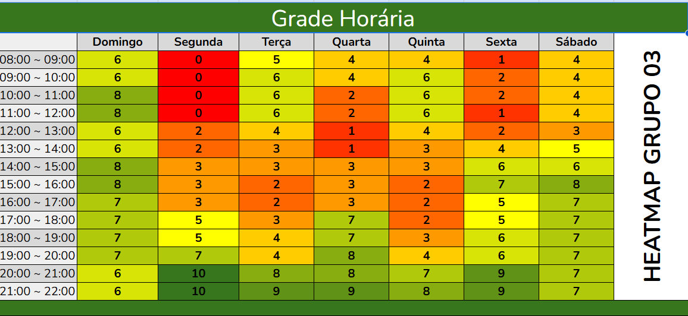

## Introdução
Com o objetivo de resolver o problema comum de encontrar horários para reuniões e 
desenvolvimento de projetos, foi elaborado um mapa de calor (Heatmap) para 
analisar a disponibilidade dos membros de um grupo.

Na Figura1, os valores variam de 0 a 10, indicando a disponibilidade geral 
do grupo em determinados horários. Um valor de 0 significa que nenhum integrante 
está disponível, enquanto um valor de 10 indica que todos os integrantes estão 
disponíveis, facilitando a escolha de horários ideais para as atividades do grupo.

<strong>Figura 1: Heatmap do grupo 03 </strong>

  

<em>Autor: <a href="https://github.com/redjsun">Yzabella Pimenta</a>.</em>

## Resultados
Após a análise dos dados preenchidos por cada integrante do grupo, foi obtido os seguintes horários:

- Segunda: das 20:00 às 22:00
- Terça: das 21:00 às 22:00
- Quarta: das 21:00 às 22:00
- Quinta: das 21:00 às 22:00

# Histórico de versões
| Versão | Data | Descrição | Autor(es) | Revisor(es) | Data da revisão |
|--------|------|-----------|-----------|-------------|-----------------|
| `1.0` | 02/07/2025 | Criação do documento, organização estrutural e de textos de cada tópico da documentação. | [Yzabella Miranda](https://github.com/redjsun)  | [Ana Luiza](https://github.com/Ana-Luiza-SC) ||