# Introdução

Esse documento tem o propósito de apresentar os resultados do questionário realizado pelo grupo 3 para a disciplina de Arquitetura de Software lecionada durante o período de 2025.2 pela docente Milene Serrano. O questionário é uma técnica estruturada usada para coletar informações de um conjunto de stakeholders (usuários, clientes, especialistas, etc.). Ele é composto por uma série de perguntas (fechadas, abertas ou mistas) que podem ser aplicadas presencialmente, por e-mail ou online.

# Objetivo

O presente questionário foi elaborado com o propósito de conhecer mais sobre os possíveis usuários do aplicativo Revele seu Hobby para compreender por quê ele deveria existir, quais as principais funcionalidades que ele deve ter e traçar o perfil de usuário. Todos os dados foram coletados com o consentimento dos usuários e nenhum dado sensível (tais como nome, cpf, telefones, e-mails) foi coletado. No total foram contabilizadas 19 respostas.

# Metodologia

O questionário foi dividido em duas seções principais. A primeira seção possui perguntas sobre gênero, faixa etária, escolaridade, familiaridade com tecnologia, nível de experiência com hobbies e frequência em que os pratica. A segunda seção possui perguntas relacionadas com funcionalidades que os usuários gostariam que um aplicativo sobre hobbies possuísse. Desse modo, as respostas mais escolhidas foram selecionadas para elicitar requisitos para a aplicação.

# Gráficos dos resultados 

Essa seção apresentará os resultados em formato de gráficos para facilitar a visualização dos dados. As respostas foram obtidas do dia 02 de Setembro de 2025 até o dia 03 de Setembro de 2025\. 

## Perfil de usuário

**Gráfico 1: Aprovação do termo de consentimento.**  
**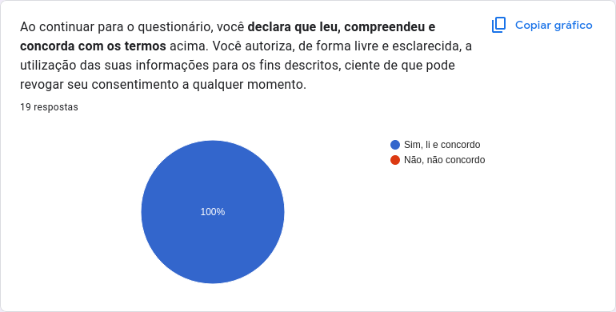**
**Fonte:** [Gabriel Flores](https://github.com/Gabrielfcoelho) e [Ana Luiza](https://github.com/Ana-Luiza-SC)  
  
**Gráfico 2: Gênero.**  
**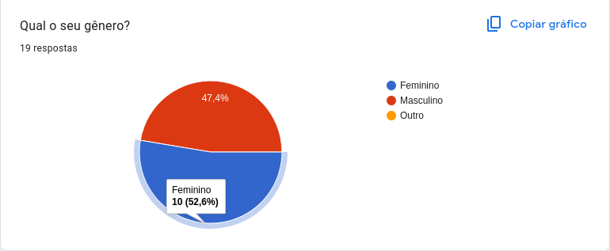**
**Fonte:** [Gabriel Flores](https://github.com/Gabrielfcoelho) e [Ana Luiza](https://github.com/Ana-Luiza-SC)  
    
**Gráfico 3: Faixa etária.**  
****  
**Fonte:** [Gabriel Flores](https://github.com/Gabrielfcoelho) e [Ana Luiza](https://github.com/Ana-Luiza-SC)  
  
**Gráfico 4: Escolaridade.**  
**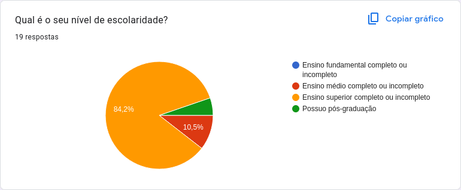**  
**Fonte:** [Gabriel Flores](https://github.com/Gabrielfcoelho) e [Ana Luiza](https://github.com/Ana-Luiza-SC)  
  
**Gráfico 5: Familiaridade com tecnologia.**  
**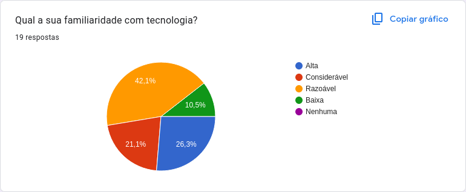**  
**Fonte:** [Gabriel Flores](https://github.com/Gabrielfcoelho) e [Ana Luiza](https://github.com/Ana-Luiza-SC)  
  
**Gráfico 6: Experiência com hobbies.**  
**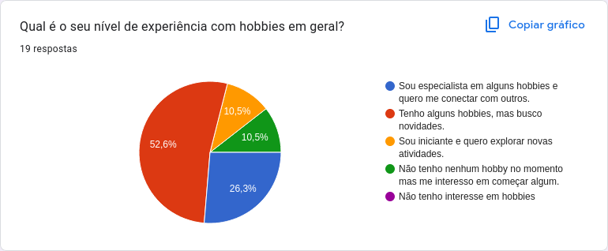**  
**Fonte:** [Gabriel Flores](https://github.com/Gabrielfcoelho) e [Ana Luiza](https://github.com/Ana-Luiza-SC)  
  
**Gráfico 7: Frequência em que pratica seus hobbies.**  
**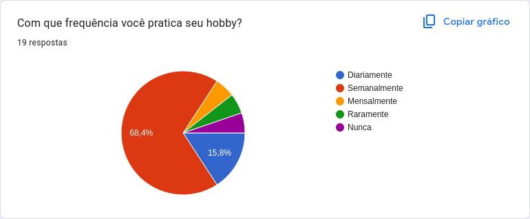**  
**Fonte:** [Gabriel Flores](https://github.com/Gabrielfcoelho) e [Ana Luiza](https://github.com/Ana-Luiza-SC)  
  
**Gráfico 8: Principais Benefícios de praticar hobbies.**  
**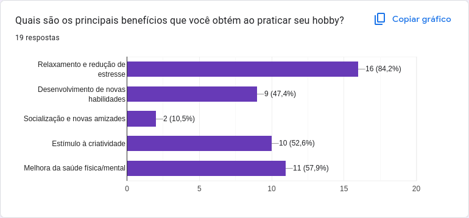**  
**Fonte:** [Gabriel Flores](https://github.com/Gabrielfcoelho) e [Ana Luiza](https://github.com/Ana-Luiza-SC)  
  
**Gráfico 9: Principais desafios ao iniciar um hobby.**  
**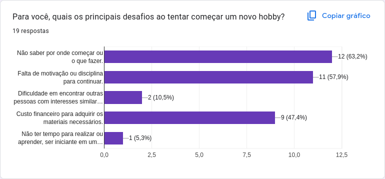**
**Fonte:** [Gabriel Flores](https://github.com/Gabrielfcoelho) e [Ana Luiza](https://github.com/Ana-Luiza-SC)  
  

## Sobre o aplicativo

**Gráfico 1: Funcionalidades mais importantes.**  
**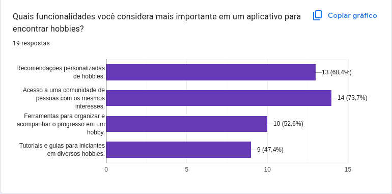**  
**Fonte:** [Gabriel Flores](https://github.com/Gabrielfcoelho) e [Ana Luiza](https://github.com/Ana-Luiza-SC)  
  
**Gráfico 2: Preferência de interação entre usuários.**  
**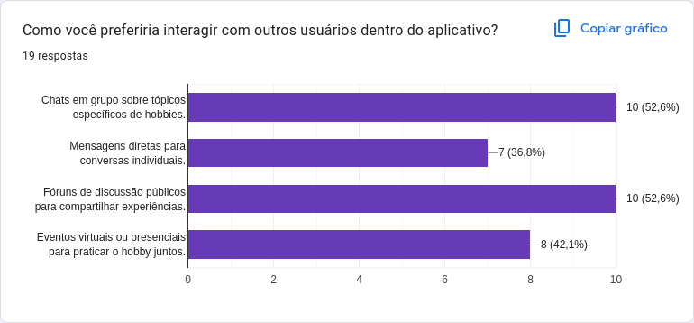**  
**Fonte:** [Gabriel Flores](https://github.com/Gabrielfcoelho) e [Ana Luiza](https://github.com/Ana-Luiza-SC)  
  
**Gráfico 3: Principais categorias de hobby.**  
**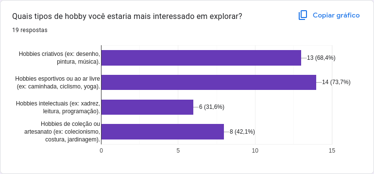**  
**Fonte:** [Gabriel Flores](https://github.com/Gabrielfcoelho) e [Ana Luiza](https://github.com/Ana-Luiza-SC)  
  
**Gráfico 4: Preferência de privacidade do perfil.**  
****  
**Fonte:** [Gabriel Flores](https://github.com/Gabrielfcoelho) e [Ana Luiza](https://github.com/Ana-Luiza-SC)  
  
**Gráfico 5: Importância de recursos de gamificação.**  
**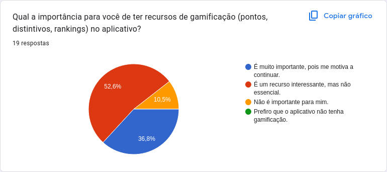**  
**Fonte:** [Gabriel Flores](https://github.com/Gabrielfcoelho) e [Ana Luiza](https://github.com/Ana-Luiza-SC)  
  
**Gráfico 6: Qual funcionalidade o aplicativo deveria se concentrar.**  
**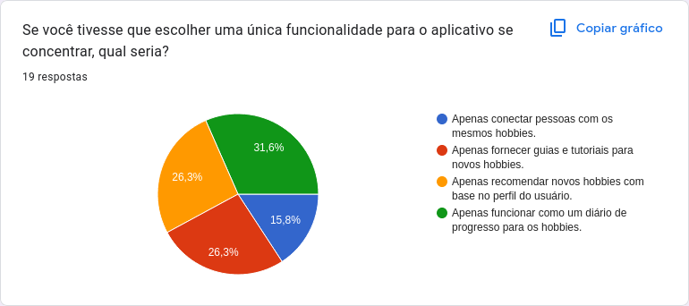**  
**Fonte:** [Gabriel Flores](https://github.com/Gabrielfcoelho) e [Ana Luiza](https://github.com/Ana-Luiza-SC)  
  
**Gráfico 7: Preferência sobre sistema de notificação.**  
**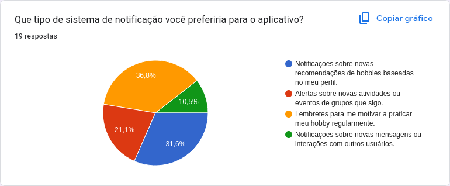**
**Fonte:** [Gabriel Flores](https://github.com/Gabrielfcoelho) e [Ana Luiza](https://github.com/Ana-Luiza-SC)  
  

# Requisitos Elicitados

Essa seção tratará dos requisitos elicitados a partir do questionário, apresentados por meio da Tabelas 1 como requisitos funcionais. Nenhum requisito não funcional foi elicitado durante o questionário.

A fim de manter a rastreabilidade dos requisitos, a legenda utilizada será:

* QTRFX : Requisito de tipo Funcional n° X

## Requisitos Funcionais

Abaixo temos a Tabela 1 com os requisitos funcionais elicitados

**Tabela 1:** Requisitos funcionais

| Identificador | Descrição |
| :---: | ----- |
| QTRF01 | Acesso a uma comunidade de pessoas com os mesmos interesses. |
| QTRF02 | Recomendações personalizadas de hobbies |
| QTRF03 | Chats em grupo sobre tópicos específicos de hobbies. |
| QTRF04 | Fóruns de discussão públicos para compartilhar experiências. |
| QTRF05 | Possuir hobbies esportivos ou ao ar livre(ex: caminhada, ciclismo, yoga). |
| QTRF06 | Possuir hobbies criativos (ex: desenho,pintura, música) |
| QTRF07 | Gerenciamento de visibilidade do perfil ( privado e público) |
| QTRF08 | Diário de progresso |
| QTRF09 | Lembretes para motivar a praticar o hobby regularmente |
| QTRF10 | Notificações sobre novas recomendações de hobbies baseadas no meu perfil. |

# Referência Bibliográfica
> Barbosa, S. D. J.; Silva, B. S. da; Silveira, M. S.; Gasparini, I.; Darin, T.; Barbosa, G. D. J. (2021)Interação Humano-Computador e Experiência do usuário. Autopublicação. ISBN: 978-65-00-19677-1. Item: 7.5.4, Acesso em 01 set. 2025

# Histórico de Versões

| Versão | Data | Descrição | Autor(es) | Revisor(es) |
| :---- | :---- | :---- | :---- | :---- |
| 1.0 | 04/09/2025 | Criação do documento e dos requisitos funcionais | [Gabriel Flores](https://github.com/Gabrielfcoelho) e [Ana Luiza](https://github.com/Ana-Luiza-SC)  | [Yzabella Pimenta](https://github.com/redjsun) |