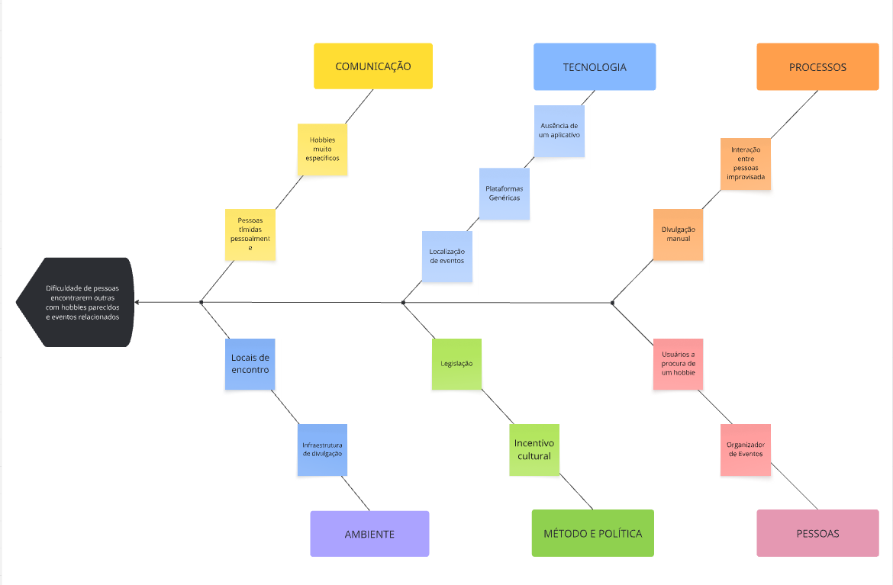

# Revele Seu Hobbie

# Nome do Projeto

**Código da Disciplina**: FGA0208 
**Número do Grupo**: 03 
**Entrega**: 01 

## Alunos
| Matrícula | Aluno |
| -- | -- |
| 23/1011088 | Ana Luiza Soares de Carvalho |
| 23/1026358 | Gabriel Flores Coelho |
| 23/1026385 | Igor Veras Daniel |
| 23/1039113 | Leonardo Porporati Barcellos |
| 22/2006169 | Natan da Cruz Almeida |
| 21/1043763 | Ruan Sobreira Carvalho |
| 23/1039187 | Yzabella Miranda Pimenta |
| 23/1026509 | Matheus de Alcantara da Silva Campos |
| 22/1022408 | Paulo Henrique Lamounier Dantas |
| 21/1031600 | Arthur Augusto Rezende da Paixao |

## Sobre 
O projeto "Revele Seu Hobbie" é uma plataforma inovadora destinada a conectar pessoas com interesses semelhantes, facilitando a descoberta e o compartilhamento de hobbies. Nosso objetivo é criar uma comunidade vibrante onde os usuários possam explorar novos passatempos, participar de eventos relacionados e interagir com outros entusiastas.

## Screenshots da Primeira Entrega

### Diagrama de Causa e Efeito

### Rich Picture 

## Há algo a ser executado?

( ) SIM

(x) NÃO

Se SIM, insira um manual (ou um script) para auxiliar ainda mais os interessados na execução.

## Informações Complementares 
Quaisquer outras informações adicionais podem ser descritas nessa seção.

## Histórico de Versões

| Versão | Data       | Descrição                       | Autor(es)               | Revisor(es)         | Data da Revisão |
|--------|------------|---------------------------------|-------------------------|---------------------|------------------|
| `1.0`    | 04/09/2025 | Criação do documento            | [Matheus de Alcântara](https://github.com/matheusdealcantara) | [Gabriel Flores](https://github.com/Gabrielfcoelho) | 04/09/2025 |
